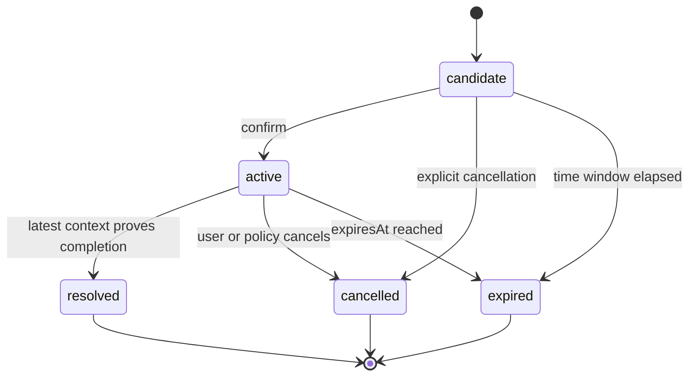

# WakeIntent 领域模型设计

> 文档状态：Draft 0.1  
> 更新日期：2026-09-02

## 1. 领域边界

WakeIntent 的核心领域不是“发送消息”，而是“管理未来联系意图并做出联系决策”。模型生成、存储、调度和投递均通过端口接入，不属于核心领域本身。

核心输入是对话事件和当前上下文，核心输出是可解释的联系决策。

```text
Conversation events
      ↓
Candidate extraction
      ↓
ContactIntent lifecycle
      ↓
Contextual reevaluation
      ↓
contact | defer | cancel | expire | silent | resolve
```

## 2. 核心术语

### 2.1 ContactIntent

从对话中产生的未来联系机会。它表达“以后可能有理由再次联系某个用户”，但不代表系统已经被授权发送，也不代表未来一定发送。

### 2.2 Evidence

支持意图存在、变化或失效的原始对话证据。证据应使用消息或事件引用，避免复制不必要的完整敏感内容。

### 2.3 Policy

确定性规则和可插拔业务策略的集合，例如免打扰、每日预算、敏感话题限制和最低置信度。

### 2.4 Decision

一次重验证的输出。Decision 是追加事件，不直接等价于持久状态，也不等价于真实投递结果。

### 2.5 Delivery

外部渠道实际尝试发送或成功送达的行为。v0.1 不实现 Delivery，仅预留边界。

### 2.6 ContactPolicySignal

来自对话证据的全局主动联系策略变化。它不属于任何单个 `ContactIntent`，不得由 relevance router 逐意图猜测。当前最小契约包含：

- `set-do-not-disturb`：设置全局免打扰截止时间；
- `clear-do-not-disturb`：恢复普通联系策略；
- `set-authorization`：把主动联系授权改为 `granted`、`denied` 或 `unknown`。

每个信号必须包含唯一 ID、来源事件、发生时间和理由。信号通过确定性 reducer 应用到 `ContactPolicySnapshot`，并记录前后状态、应用时间和 `applied` / `duplicate` / `expired` 结果。模型只能提取候选信号，不能直接覆盖用户策略状态。core 必须验证来源确实是用户事件，并直接使用该事件的时间作为正式 `occurredAt`，不得相信模型生成的事件时间。

## 3. ContactIntent 最小字段

| 字段 | 类型 | 必填 | 说明 |
|---|---|---:|---|
| `schemaVersion` | string | 是 | Schema 版本，例如 `0.1.0` |
| `id` | string | 是 | 全局唯一标识 |
| `status` | enum | 是 | `candidate`、`active`、`resolved`、`cancelled`、`expired` |
| `subject` | string | 是 | 简洁描述正在跟进的事项 |
| `reason` | string | 是 | 为什么未来可能值得联系 |
| `target` | object | 是 | 目标用户、会话或参与者引用 |
| `evidence` | array | 是 | 来源证据引用，至少一项 |
| `notBefore` | datetime/null | 是 | 最早允许评估联系的时间 |
| `expiresAt` | datetime/null | 是 | 超过后不得联系的时间 |
| `cancellationHints` | array | 是 | 可能表明意图失效的语义条件 |
| `priority` | number | 是 | 业务重要程度，建议标准化为 0–1 |
| `interruptionCost` | number | 是 | 对用户造成打扰的估计，建议 0–1 |
| `confidence` | number | 是 | 意图提取置信度，0–1 |
| `createdAt` | datetime | 是 | 创建时间 |
| `updatedAt` | datetime | 是 | 最近状态更新时间 |
| `metadata` | object | 否 | 扩展字段，不得改变核心语义 |

## 4. 持久状态与决策结果分离

### 4.1 持久状态



`contacted` 不属于 v0.1 状态，因为没有真实投递系统时无法证明用户收到消息。后续投递扩展应通过 DeliveryEvent 表示 attempted、accepted、delivered、failed 等结果。

### 4.2 重验证决策

| 决策 | 含义 | 是否终结意图 |
|---|---|---:|
| `contact` | 当前值得生成联系行为 | 否 |
| `defer` | 当前不合适，指定下次评估时间 | 否 |
| `silent` | 当前没有足够理由联系，可不指定下次时间 | 否 |
| `cancel` | 用户或策略明确要求停止 | 是 |
| `expire` | 已超过有效时间或语义时效 | 是 |
| `resolve` | 最新上下文证明事项已完成或已得到结果 | 是 |

## 5. 领域事件

所有变化使用追加式事件记录，最低包括：

- `intent.candidate_created`
- `intent.activated`
- `intent.reevaluated`
- `intent.deferred`
- `intent.silenced`
- `intent.contact_recommended`
- `intent.cancelled`
- `intent.expired`
- `intent.resolved`
- `policy.signal_applied`
- `policy.signal_ignored_duplicate`
- `policy.signal_expired`

每个事件至少包含：事件 ID、意图 ID、发生时间、前后状态、决策、理由、证据引用、策略版本、模型运行信息和关联 ID。

## 6. 核心接口契约

### 6.1 extract()

输入：

- 对话事件列表；
- 当前时间与时区；
- 可选业务策略；
- 可选用户授权状态。

输出：

- 零个或多个候选意图；
- 每个候选的证据、置信度和提取理由；
- 被拒绝候选的可选诊断信息。

约束：

- 不得假设每段对话都需要创建意图；
- 不得仅凭出现日期就自动创建意图；
- 不得把模型生成内容伪装成用户证据；
- 相同输入允许通过幂等策略避免重复候选。

### 6.2 reevaluate()

输入：

- 当前 `ContactIntent`；
- 从创建后到当前的相关新对话；
- 当前时间、时区和用户状态；
- 适用策略与预算快照。

输出：

- 决策枚举；
- 决策理由；
- 支持与反对联系的证据；
- 置信度；
- 可选 `nextEvaluationAt`；
- 建议的状态转移；
- 本次运行元数据。

## 7. 决策顺序

重验证采用“确定性门控优先，语义判断随后”的顺序：

1. Schema 与状态合法性检查；
2. 显式取消检查；
3. 过期检查；
4. 用户授权与敏感话题检查；
5. 免打扰、频率和预算检查；
6. 最新上下文语义重验证；
7. 多意图排序与打扰成本权衡；
8. 生成决策事件。

模型不得推翻前五项确定性拒绝结果。

全局策略信号先于上述单意图决策应用：

1. 从对话事件提取零个或多个候选策略信号；
2. 使用来源事件、时间顺序和幂等 ID 校验信号；
3. 更新 `ContactPolicySnapshot`；
4. 将同一策略状态广播给所有待评估意图的硬门控；
5. 只有意图自身语义发生变化时才进入 relevance router。

## 8. 时间语义

- 所有持久化时间使用带偏移的 ISO 8601 字符串或 UTC 时间戳。
- 用户时区作为独立上下文字段保存，不将本地时间直接当作 UTC。
- `notBefore` 表示最早允许评估，不表示必须在该时刻联系。
- `expiresAt` 是硬边界，到期后只能输出 `expire`。
- fake clock 是所有生命周期测试的唯一时间源，业务代码不得直接调用全局系统时间。

## 9. 版本与扩展

- `schemaVersion` 使用语义化版本。
- 未识别的扩展字段保存在 `metadata`，核心不得依赖它们做隐式行为。
- v0.1 只保证单目标用户/会话；群聊、多参与者和跨渠道身份解析留待后续版本。
- Delivery、Scheduler、Persona 和 Memory 作为外部扩展，不进入基础 Schema 的必填字段。
