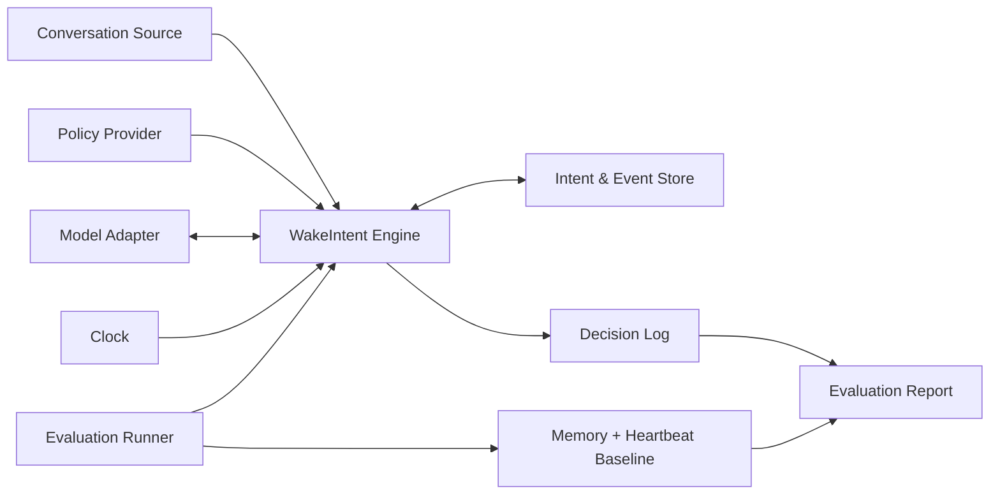
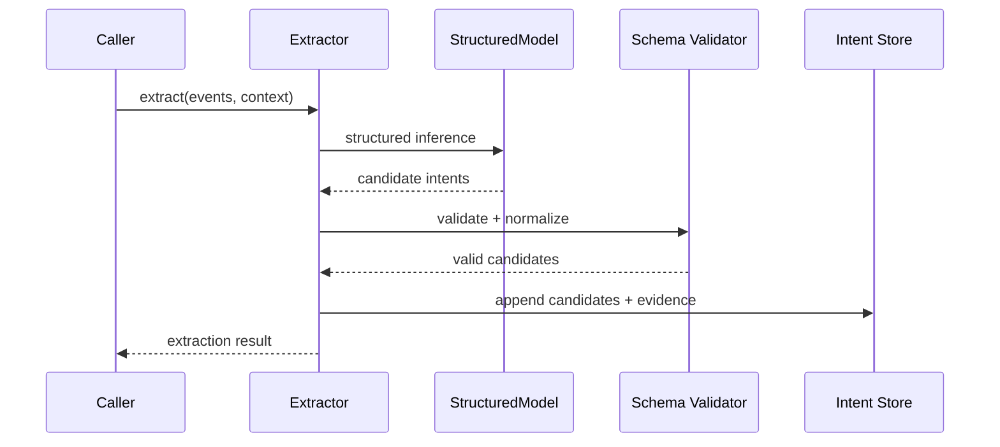
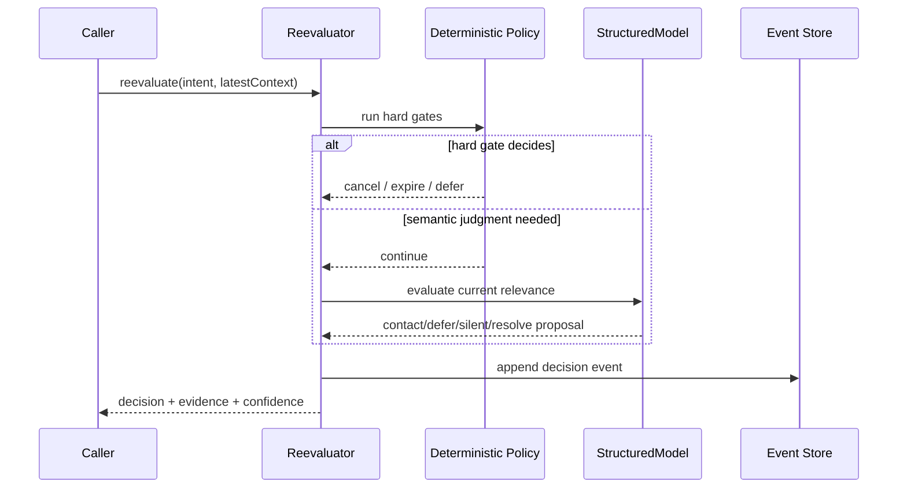
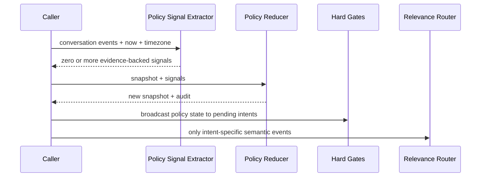

# WakeIntent v0.1 系统架构

> 文档状态：Draft 0.1  
> 更新日期：2026-09-02

## 1. 架构目标

1. 证明 `ContactIntent` 是独立于具体 Agent 和客户端的领域抽象。
2. 保证模型、时间、存储和策略可替换，以支持公平评测。
3. 让确定性规则与模型语义判断明确分层。
4. 让每个决策可追溯、可重放、可比较。
5. 避免 v0.1 被真实调度、投递和 UI 复杂度拖垮。

## 2. 系统上下文



WakeIntent v0.1 不直接连接消息渠道。`contact` 只写入决策日志，评测运行器将它视为“建议联系”，而不是已投递。

## 3. 逻辑组件

### 3.1 `domain`

包含 `ContactIntent`、领域事件、决策、状态转移和错误类型。不得依赖模型 SDK、数据库、Web 框架或 UI。

### 3.2 `schema`

保存 JSON Schema 2020-12 契约，并负责运行时校验。JSON Schema 是跨语言交换的权威契约，TypeScript 类型必须与其一致。

### 3.3 `extractor`

把标准化对话事件交给模型适配器，解析结构化候选，执行最低置信度、证据存在性和重复候选检查。

### 3.4 `reevaluator`

协调确定性门控、相关上下文选择和模型语义判断，返回统一 Decision。

### 3.5 `policy`

提供无模型的规则接口，包括授权、过期、显式取消、免打扰、预算、敏感话题和多意图排序。策略必须版本化。全局 `ContactPolicySignal` 先通过可重放、幂等的 reducer 写入策略快照，再由同一快照广播到所有意图；逐意图 relevance router 不负责保证全局策略召回。

### 3.6 `ports`

定义以下外部端口：

- `Clock`
- `ContactIntentStore`（以 `activateIntent()` / `commitDecision()` 原子保存意图状态、排期投影和统一审计事件）
- `StructuredModel`
- `ContextProvider`
- `PolicyProvider`
- `UsageRecorder`

### 3.7 `adapters`

提供 v0.1 参考适配器：system clock、fake clock、in-memory store、JSON file store、fake model 和一个 OpenAI-compatible model adapter。

### 3.8 `evaluation`

加载版本化场景，分别运行 WakeIntent 与基线，收集决策、状态、token、费用和延迟，计算指标并输出报告。

### 3.9 `cli`

用于校验场景、运行单个场景、批量评测和生成报告。CLI 只编排模块，不放置领域逻辑。

## 4. 建议的代码边界

```text
packages/
  core/              # domain + use cases + ports
  schemas/           # canonical JSON Schemas
  model-openai/      # reference model adapter
  store-json/        # Alpha 0.1 local persistence adapter
  evaluation/        # scenarios, baseline, metrics, reports
  cli/               # developer-facing commands
scenarios/
  fixtures/          # versioned public scenarios
docs/
```

这是目标结构，不要求第一次提交就创建全部包。拆包的判断标准是“是否形成独立发布和依赖边界”，而不是为了看起来像大项目。

## 5. 关键流程

### 5.1 候选提取



### 5.2 重验证



### 5.3 全局策略入口



当前已实现 reducer、公共 JSON Schema、幂等与时间顺序校验，以及策略状态对多个意图硬门控的广播测试。自然语言 extractor 已具备框架无关的 core 接口和 OpenAI-compatible Structured Outputs 参考适配器：模型只返回候选草稿，core 再校验用户证据、派生发生时间并生成正式信号。提取输入包含只读的当前策略快照，使“现在可以联系”能够根据已有免打扰或授权状态解释为真正的状态变化，而不是脱离状态猜测。连续时间线已接入该入口；有限免打扰会直接推迟窗口内所有已排期意图，不依赖逐意图 relevance router，也不在原到期点调用语义模型；提前清除免打扰会恢复保存的原排期。离线测试覆盖空结果、无效证据、重复草稿、时间边界、矛盾模型输出、复合状态归一化、双意图广播和排期恢复。

## 6. 基线架构

“记忆 + heartbeat”基线必须与 WakeIntent 使用：

- 相同模型和模型参数；
- 相同原始对话；
- 相同当前时间和时区；
- 相同可见上下文预算；
- 相同输出决策集合。

基线只保存简化的未来跟进记忆，并在固定 heartbeat 时把记忆与最新上下文交给模型判断，不使用 `ContactIntent` 的显式失效字段和生命周期机制。

## 7. 数据与隐私边界

- Core 接受调用方提供的上下文，不自行抓取邮箱、日历或屏幕。
- 默认日志保存证据引用和必要片段，不复制完整聊天历史。
- 真实模型运行前必须允许调用方配置脱敏器。
- 公开场景只能使用合成或获得授权的数据。
- 模型输出始终视为不可信输入，必须通过 Schema 和领域规则校验。

## 8. 可靠性边界

v0.1 保证：

- 同一场景可重放；
- 状态转移合法；
- 决策事件追加且不覆盖；
- 文件存储进程重启后可恢复；
- 相同幂等键不创建重复候选。

v0.1 不保证：

- 分布式并发安全；
- exactly-once 投递；
- 外部消息渠道成功率；
- 多节点调度恢复；
- 高可用和水平扩展。

## 9. 后续扩展点

- Scheduler：按 `nextEvaluationAt` 唤醒；外部对话事件先经过可替换的 relevance router，只重验证可能受影响的 active intent。路由调用、语义调用和确定性检查必须分别计费与审计。
- Delivery：lease、幂等键、投递尝试与 receipt。
- Persona Policy：角色关注点、主动程度和表达策略。
- Client：参考聊天客户端与可解释决策面板。
- Framework Adapters：OpenClaw、LangGraph、AstrBot、MCP。
